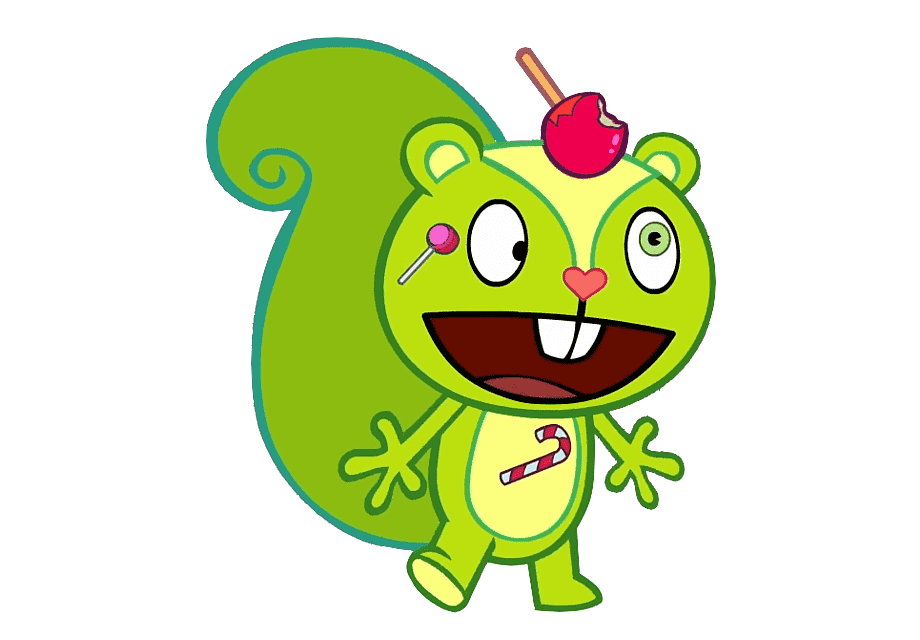

<!-- theme: default -->
<!-- class: invert -->
<style>
  h1 {
    color: #26890d;
    position: absolute;
    top: 60px;
    left: 75px;
    right: 75px;
  }
</style>

# Kotlin Sugar High

Discussing about taste

---

# $> whoami

## Dominik Zmitrowicz

Professionaly fighting with imposter syndrome since 2009.

Pretending to know Kotlin for 2 years.

---

# What is this about

 - Kotlin
 - Sugar
 - Nightmares

---



---
<style scoped>
    h2 {
      text-decoration-line: underline;
      text-decoration-style: wavy;
      text-decoration-color: white;
    }
</style>

# What is this about
## 11 kinds of programmers

 - one way enjoyers
 - muh freedom!

---

<style scoped>
    h2 {
      text-decoration-line: underline;
      text-decoration-style: wavy;
      text-decoration-color: white;
    }
</style>

# What is this about
## 11 kinds of programmers

 - one way enjoyers
 - muh freedom!
 - I am sure I can write it in one line

### I will be exaggerating

---

# Not about

 - performance
 - bytecode
 - coroutines

---
# Sealed classes

``` kotlin

sealed class Animal(val favoriteFood: String)

class Dog(favoriteFood: String) : Animal(favoriteFood)

class Horse(favoriteFood: String) : Animal(favoriteFood)

```
---
# Sealed classes

```kotlin
sealed class Demon()

class Cat() : Demon()

class Oni() : Demon()

class Rakshasa() : Demon()

```

---

## Code

---
# Sealed classes

### *Nihil novi*
Already exists in other languages. Also in Java.

### Sub-classes in same package

### Mocking issues
Mockk-ing is fine.

### But still cool!

### Enumy taste

---

# Pattern matching

## Unlock the power of sealed classes

## Also check contents of containers

## Other stuff

## But not too much
Maybe this will get improved as Java 21 has even moar power

---

## Code

---
# Destructuring
```kotlin
  data class Point(val x: Int, val y: Int)

  val (horizontal, _) = Point(1, 2)
```
```kotlin
  for ((key, value) in map) {
     // do something with the key and the value
  }
```
```kotlin
  map.mapValues { (key, value) -> "$value!" }
```
---

# Extension functions

``` kotlin
  fun ExternalClass.missingFunction() {}
```

## Cool way to not die from lib poisoning

## Very usefull for writing transformers/converters

---

## Code


---

# Top level

## We don't need no util classes

---

# Aliasing

``` kotlin
  import com.external.library.ClashingOrStupidName as MyName
```
```kotlin
  typealias Bucket = List<Files>
```
```kotlin
  typealias SingletonList = (Item) -> List<Item>

  class SingletonListImpl : SingletonList {
      override fun invoke(item: Item) : List<Item> { ... }
  }
```

---

# Constructors and inits

## Fancy shmancy
 - primary 
 - inits / properties in order of appearance
 - secondary

---

## Code


---

# Function magic

## Named parameters

## Default parameters

``` kotlin
  fun method(name: String, surname: String = "Doe") {}

  method(name = "John")
```

---

# Function magic

## Overload operators
 `a+` - `a.unaryPlus()`
 `a + b` - `a.plus(b)`
 ...
[List of operators](https://kotlinlang.org/docs/operator-overloading.html)

---

# Function magic

## Infix functions
 Custom binary operators
```kotlin
  fun String.obliterate(toRemove: String) : String {...}

  "Tom & Jerry" obliterate "Jerry"
  "Tom & Jerry".obliterate("Jerry")

```

---

## Code


---

# Function magic

## Tail recursion
 Optimized into loops
 `tailrec`

---

# Function magic

## High order functions
```kotlin
  fun List<Bug>.processBugs(fix: (Bug)-> Unit) { 
    for(bug in this) {
      fix(bug)
    }
  } 
```

---

# Scoped functions

## Granting access through `it`
`let`, `also`, `takeIf`, `takeUnless`
``` kotlin
  something?.let { performNullSafeOp(it) }
  val otherOrNull = something.takeIf { satisfiesLogic(it) }
```

---

# Scoped functions

## Access through `this`
`run`, `with`, `apply`
``` kotlin
  with(something) {
    this.function1()
    function2()
  }
```

---
# Strings

Cool stuff!

---

## Code


---

# Tricky tricky nullability

## Using java classes

## Compiler is not perfect

## Bang bang!

---

## Code


---

# Lots of other sweets

## DSL

## Generics

## Delegation

## getters setters

---
<style scoped>
  s {
    font-size: 25%;
  }
</style>

# Thank you

## Questions?

~~I hope not~~

## Sources
[Kotlin docs](https://kotlinlang.org/docs/home.html)
[6 magic sugars to keep your kotlin codebase happy](https://medium.com/@piotr.slesarew/6-magic-sugars-that-can-make-your-kotlin-codebase-happier-part-1-ceee3c2bc9d3)
[Kotlin pitfalls and how to avoid them](https://the-cogitator.com/posts/blog/2017/10/02/kotlin-pitfalls-and-how-to-avoid-them.html)

## Slides and code
https://github.com/dogrizz/kotlin-sugar-high

